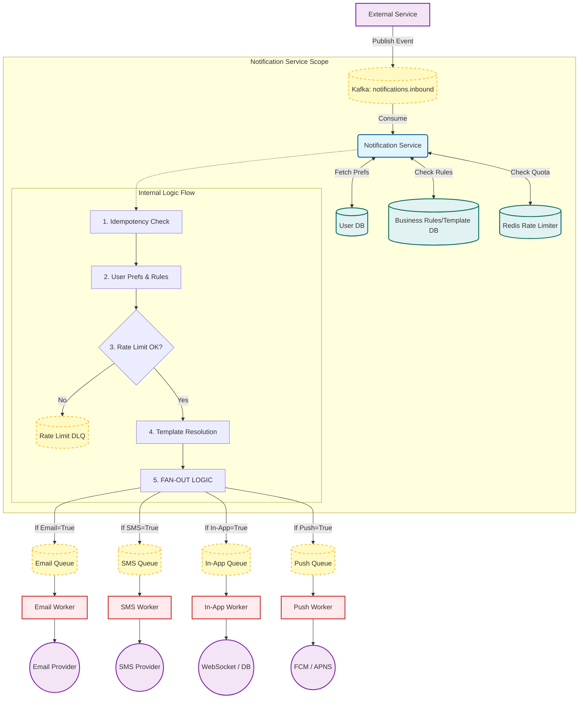

# Notification System

A **scalable, event-driven notification system** built with **Node.js** and **TypeScript**.
Designed to handle **high-throughput**, **multi-channel notifications** (Email, SMS, In-App, Push) with strong reliability guarantees such as **idempotency**, **rate limiting**, and **retries**.

---

## Architecture Overview

The system follows a **microservices-based, event-driven architecture**.

1. **Kafka** is used for inbound event ingestion.
2. A central **Notification Service** consumes events, applies business logic, and fans out jobs.
3. **RabbitMQ** is used as a job queue to distribute work to channel-specific workers.
4. **Redis** handles idempotency and rate limiting.
5. Dedicated workers deliver notifications via external providers.



## Features

### Event Driven

- Asynchronous ingestion using **Apache Kafka**
- Decouples producers from notification delivery

### Idempotency

- Redis-based deduplication using message IDs
- Prevents duplicate notifications on retries or replays

### Rate Limiting

- Sliding window rate limiter in Redis
- Example: `max 5 emails per user per hour`
- High-priority messages can bypass limits

### User Preferences

- Stored in **PostgreSQL**
- Honors opt-in / opt-out per channel (Email, SMS, etc.)

### Reliable Delivery

- **Retries** via RabbitMQ delayed exchanges (`x-delayed-message`)
- **Exponential backoff**
- **Dead Letter Queues (DLQ)** for failed messages

  - `email.dlq`
  - `sms.dlq`

---

## Tech Stack

| Category         | Technology   |
| ---------------- | ------------ |
| Language         | TypeScript   |
| Runtime          | Node.js      |
| Ingestion Broker | Apache Kafka |
| Job Queue        | RabbitMQ     |
| Database         | PostgreSQL   |
| Cache / Locking  | Redis        |
| Validation       | Zod          |

---

## Setup & Installation

### Prerequisites

Ensure the following services are running (Docker recommended):

- PostgreSQL
- Redis
- RabbitMQ

  - `rabbitmq_delayed_message_exchange` plugin enabled

- Kafka + Zookeeper

---

### 1️. Notification Service

```bash
cd Notification

# Install dependencies
npm install

# Setup environment variables
cp .env.example .env
# Configure DATABASE_URL, REDIS_URL, KAFKA_BROKER, RABBITMQ_URL

# Run database migrations
npm run migrate:up

# Start service
npm run dev
```

---

### 2️. Email Worker

```bash
cd Email-Worker

# Install dependencies
npm install

# Start worker
npm run dev
```

---

## Event Payload Schema

Publish a JSON message to the Kafka **Notification** topic:

```json
{
  "id": "uuid-v4-string",
  "userId": "123",
  "type": ["email", "sms"],
  "priority": "high",
  "to": "user@example.com",
  "notification": "Video_Processing_Complete",
  "action_url": "https://example.com/videos/123"
}
```

### Field Description

| Field          | Description                              |
| -------------- | ---------------------------------------- |
| `id`           | Unique message ID (used for idempotency) |
| `userId`       | Target user ID                           |
| `type`         | Channels to send (`email`, `sms`, etc.)  |
| `priority`     | `high` bypasses rate limits              |
| `to`           | Destination address (email / phone)      |
| `notification` | Template key                             |
| `action_url`   | CTA link included in message             |

---

## Supported Notification Types

- `Video_Processing_Complete`
- `Video_Processing_Failed`
- `Video_Audio_Transcription_Complete`
- `Video_Audio_Transcription_Failed`

---

## Reliability Guarantees

- **At-least-once delivery**
- **Idempotent processing**
- **Backpressure handling via queues**
- **Safe retries with exponential backoff**
- **DLQ for debugging & replay**

---

## Scalability Notes

- Kafka consumers scale horizontally via consumer groups
- RabbitMQ workers scale independently per channel
- Redis ensures consistency across instances
- Stateless services → easy horizontal scaling

---

## Future Improvements

- Circuit breaker per provider
